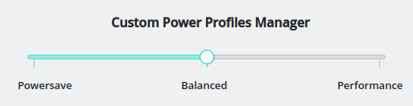
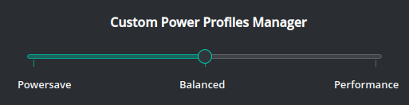
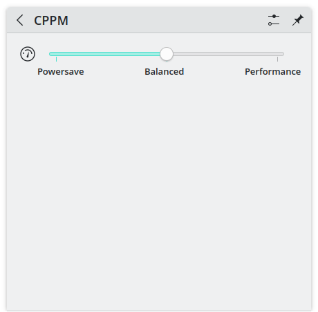
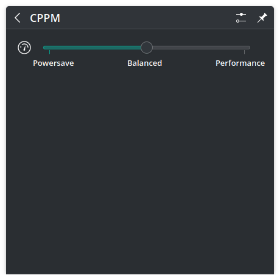

# CPPM - Custom Power Profiles Manager

Qt based GUI program to handle user made power profiles.

The profiles can be configured to do anything that a bash script run as root can do.

The backend for writing to files is fully handled by systemd.

The GUI part is made of a simple slider that changes the power profile, without ever needing root permissions thanks to systemd path monitoring.

There are two versions available:
* Standard application: works on most desktop enviroments with a system tray icon and a popup style slider menu
* Plasmoid: works only on KDE Plasma, but it provides an interface as close as possible to the native style

## Pictures
  
*Regular app - clear theme*

  
*Regular app - dark theme*

  
*Plasmoid - clear theme*

  
*Plasmoid - dark theme*

## Installation
### Install from package manager
Currently the supported packages for package managers are DEB and RPM.

For other distributions you can build the package from source or install through the archive file and install script, as shown in the instructions below.

### Install from prebuilt archive
To install the package from prebuilt, all you need to do is download the desired package from the release page.

After that run:

```
$ curl -sSL https://raw.githubusercontent.com/DD3Boh/CPPM/master/install.sh | bash -s <packagePath>
```

After this, everything should be installed properly.

### Uninstall from prebuilt archive
If you installed from the prebuilt package, like instructed above, and you want to remove the program, just run:

```
$ curl -sSL https://raw.githubusercontent.com/DD3Boh/CPPM/master/uninstall.sh | bash -s <packagePath>
```

The package should be the same used for the installation, as it is needed to obtain the installed files list.

### Install from source
Run the install script:

```
$ ./scripts/build-install.sh <target>
```

target can be:
* `app`: Build the regular application, works on most desktops
* `plasmoid`: Build the plasmoid extension for KDE Plasma

Enable the systemd entry:

```
$ systemctl enable cppm
```

If you want to start the service without rebooting, you need to start both the service and the path files:

```
$ systemctl start cppm.service cppm.path
```

### Uninstall from source
Run the uninstall script:

```
$ ./scripts/build-uninstall.sh <target>
```

target can be:
* `app`: Build the regular application, works on most desktops
* `plasmoid`: Build the plasmoid extension for KDE Plasma

The systemd entries will be automatically stopped and disabled, and the profile will be re-set to balanced.

## Edit profiles
By default the profiles simply change the governors for all the cpus, by writing to the cpufreq nodes.

To change the profiles behavior, just edit the `/usr/share/cppm/user` file. The folder is empty by default, but you can take `systemd/cppm` as an example.

When the user file is empty or non existent, the script in `/usr/lib/systemd/scripts/cppm` gets loaded instead.

Be sure to set the correct permissions for the file, which ideally should be 755.

**DO NOT SET WRITE PERMISSIONS FOR ANYONE BUT ROOT, IF YOU DO ANY USER COULD SET ANY COMMAND TO BE RUN AS ROOT**

Inside the `cppm` script, the values are set inside a case, with values being:

1. Powersave
2. Balanced
3. Performance

Here's the default configuration to take as an example:

```
cores=$(nproc --ignore=1)

case "$mode" in
	"1")
		for ((policy = 0; policy <= $cores; policy++)); do
		echo "powersave" > "/sys/devices/system/cpu/cpufreq/policy$policy/scaling_governor"
		done
		;;

	"2")
		for ((policy = 0; policy <= $cores; policy++)); do
		echo "schedutil" > "/sys/devices/system/cpu/cpufreq/policy$policy/scaling_governor"
		done
		;;

	"3")
		for ((policy = 0; policy <= $cores; policy++)); do
		echo "performance" > "/sys/devices/system/cpu/cpufreq/policy$policy/scaling_governor"
		done
		;;
esac
```

This configuration can be used as-is just fine, without additional change.
